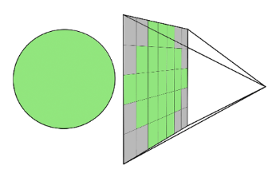
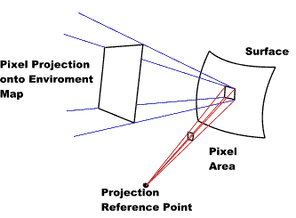
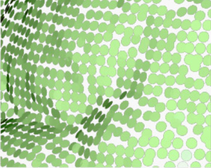

{width="4.072916666666667in"
height="2.3333333333333335in"}

**[Introduction](#introduction) 3**

> [Purpose of this document](#purpose-of-this-document) 3
>
> [Previous research](#previous-research) 3
>
> [Research questions](#research-questions) 3

**[Definition](#definition) 4**

> [Why surfels?](#why-surfels) 4

**[EA SEED](#ea-seed) 5**

> [Surfel placement](#surfel-placement) 5
>
> [Global Illumination](#global-illumination) 6

**[High-level implementation](#high-level-implementation) 7**

> [LDI/LDC Tree](#ldildc-tree) 7

**[Point-based approximate color
bleeding](#point-based-approximate-color-bleeding) 9**

> [Generating the surfels](#generating-the-surfels) 9
>
> [Calculating color bleeding](#calculating-color-bleeding) 10

**[Conclusion](#conclusion) 11**

> [Risk analysis](#risk-analysis) 11
>
> [Time estimation](#time-estimation) 11

**[References](#references) 12**

Introduction
------------

### Purpose of this document

The aim of this document is to explain what surfels are, how they are
currently being used, and how it could enhance our project. A conclusion
can be found at the end of the document. This contains a brief summary
of the outcomes of the research and the most important things the reader
might want to know about surfels and spatial storage.

### Previous research

Our team has never done any research into surfels. Therefore, this
document will start from scratch and build upon the fundamentals
explained in the first chapter.

### Research questions

-   What are surfels?

-   What are surfels used for?

-   How does EA SEED use surfels?

-   How does Pixar use surfels?

-   Can we use surfels for our project?

    -   Time estimation.

    -   Risk analysis.

    -   Conclusion.

Definition
----------

Surfels are 'surface elements' or 'surface voxels' in the volume
rendering literature. Others describe it as a zero-dimensional *n*-tuple
with shape and shade attributes that locally approximate an object
surface. Objects can be represented by a dense set of points (surfels)
holding lighting information.

### Why surfels?

Because the team did not have the budget to solve global illumination
every frame, some sort of special or temporal accumulation was needed.
The budget was roughly 250.000 rays per frame to calculate the global
illumination.

When storing light accumulation, there are generally two way to store
the data: screen-space and world-space. The advantage of screen-space
storage is that the resolution increases when the camera moves closer to
a surface. However, this only works really well for static environments.
It does not work as well for dynamic scenes as "ghosting" could become
visible.

Therefore, the team chose to go with world-space storage for the global
illumination accumulation. This is where surfels come into play. Each
surfel stores a position, normal, radius, and some animation
information. The surfels are persistent. This allows for global
illumination accumulation over time.

Surfels can be skinned. This makes it possible to place surfels on
animated meshes. Each surfel has a smooth falloff, which gives a uniform
look during rendering.

To apply surfels to the screen, a technique similar to rendering
deferred light sources. The payload per surfel is just irradiance, no
direction.

Surfels are culled using a world-space data structure very much like an
octree. Each cell stores a list of intersecting surfels. Each point in
space can query the data structure and find all relevant surfels.

EA SEED
-------

Common applications of Surfels are medical scanner data representations,
rendering surfaces of volumetric data and real-time rendering of
particle systems. Surfels are also used to improve the efficiency of GI
(Global Illumination) as Tomasz Stachowiak from EA SEED describes.

In interactive applications like games or game engines, surfels are very
useful to store lighting data in. This can make lighting passes much
faster since lighting data is already available at areas where surfels
are spawned.

### Surfel placement

The placement algorithm uses G-buffer information and it's an iterative
hole filler. Starting from calculating the coverage of each pixel by the
current surfel set, it should look for pixels with low coverage so it
can spawn new surfels in those locations. EA SEED found a way to find
those low coverage signals.

They first divided the screen in tiles (in their case: 16x16 pixels) and
for each tile, they find the lowest coverage signal using 'group atomic
sense wave operations'. Then, the surfel is spawned using the G-buffer's
depth and normal data. One thing to take into account is the pixel's
projected area. When you're facing a wall, you don't want a lot of
surfels spawning there, based on only the screen (16x16)-tiles, because
the distribution of the surfels isn't the same as it is for objects that
are further away.

{width="2.807292213473316in" height="1.75in"}

A projected pixel area is exactly what it says. Take the images to the
right as examples. The image is rendered on a window of 7x5 pixels. Each
green pixel covers a part of the sphere, which is the projected area.
The lower image shows it even better. The projected area of the pixel
can be seen on the surface and determines the projected area of the
pixel.{width="2.901042213473316in"
height="2.146178915135608in"}

So, if the projected area of the pixel is too small, the surfel
placement algorithm takes this into account and won't spawn a lot of
surfels very close to each other. It will equally distribute the surfels
just like it should on objects further away.

This process of spawning new surfels at poor coverage areas happens
every frame. A newly spawned surfel will compute more samples than an
already spawned surfel to reduce noise. A spawned surfel will roughly
compute one path trace per frame. When a path trace is traced and hits a
surfel, it uses the lighting data of that surfel, reuses its own
lighting data from the previous frame and amortizes the extra bounces
over time to calculate the new/improved lighting data.

This algorithm is much closer to radiosity than path tracing, but the
visual result is quite similar.

### Global Illumination

Surfels can be used in a lot of applications/techniques. This can be in
medical applications to store regional data of scans or in interactive
applications with interactive GI. Surfels are really useful for GI,
because they store lighting data of a small area, which the GI can find
and 'easily' render a scene with interactive GI.

One method to implement this is the Monte Carlo method. However, this is
not good practice to use in interactive applications with a dynamic
scene. The Monte Carlo method does a hard reset everytime something in
the scene changes. This shows weird artifacts (use can see the lighting
data changing/calculating) on models as soon as something changes its
orientation.

Instead, you can use a modified exponential means estimator. The
formulation is very similar to the formulation of plain Monte Carlo.
However, the blending factors are defined in another way. Exponential
averaging the weights for a new sample is constant (usually set to a
small value) so that the input variance will not be jarring in the
output. It's easy to notice that if the input doesn't have high
variance, then the output won't either. This is potentially wasting
convergence speed. You can potentially use a higher blending factor when
detecting that variance is low.

The specifics of EA SEED's integrands are changed dynamically all the
time. You need to figure this out from the scene by using short terms
statistics of mean and variance to inform the long-term blending
factors. That gives the idea of the plausible range of values that the
sample should fall into. When you create new ones, they should follow
them like 2σ, for example.

When they start to drift you can increase the blending factor.

Eventually, this gives a better effect than the Monte Carlo method,
because this method exponentially changes to simulate correct GI.

High-level implementation
-------------------------

There are at least two ways to implement surfels in spatial storage.
Either using LDI/LDC trees or the Pica Pica approach: using screen-space
to determine where to spawn surfels stored in a tree very similar to an
Octree. Since that is already described in the *[[EA
SEED]{.underline}](#ea-seed)* section, I'll only go over the LDI/LDC
tree.

### LDI/LDC Tree

*Hanspeter Pfister*, *Matthias Zwicker*, *Jeroen van Baar*, and *Markus
Gross* explain this tree really well in their research document\[1\].
LDC stands for Layered Depth Cube and LDI stands for Layered Depth
Image. A LDC consists of three LDI's. This describes the cube.

{width="2.906836176727909in"
height="1.890625546806649in"}

They use ray-tracing to create these three LDI's. The LDI's store
multiple surfels along each ray, one for each ray-surface intersection
point.

This tree is also based on an Oct-tree. Each octree node stores one LDC,
which is called a 'block'. The whole tree is also known as a LDC-tree.
On this tree, a '3-to-1 reduction'-step is performed and reduces the
LDC's to single LDI's on a block-by-block basis. To increases the
rendering speed.

The rendering pipeline projects the blocks to screen space using
perspective projection and is accelerated by block culling and some
other techniques (Forward Warping, Visibility Splatting etc. (the
pipeline can be seen in the image below and is described in the PDF of
*Pfister*, *Zwicker*, *van Baar*, and
*Gross*)\[1\]).{width="6.5625in"
height="1.141304680664917in"}

At each ray intersection point, a surfel is created with floating point
depth and other shape- and shade- (if implemented) properties.

To reduce storage and rendering time it is useful to optionally reduce
the LDC's to one LDI on a block-by-block basis. Reducing the amount of
LDI's per block is pretty straightforward. Get all intersection points
of the sample rays (where the sample rays of the three LDI's intersect).
These intersection points are used by Nearest Neighbor interpolation:
sampled surfel positions find the nearest intersection point and get
bound to that. Although, a more sophisticated filter, like Splatting,
could easily be implemented.

This means that the quality of the surfels locations depends on the
density of the sampled rays per LDI's.

Point-based approximate color bleeding
--------------------------------------

Point-based color bleeding is a global illumination technique. It makes
use of a surfel cloud to represent the surface of an object. A surfel
cloud is very similar to a point cloud. However, the surfel cloud
consists out of polygonal meshes with overlapping surfels, instead of
just points.

In point-based approximate color bleeding, surfels are used to represent
the direct illumination of the scene. Each surfel stores a position,
normal, color, and radius. When calculating the color bleeding value of
a specific point, the closest surfels within a certain radius are used
to determine the color bleeding value.

  {width="3.1041666666666665in" height="2.5in"}   {width="3.1041666666666665in" height="2.4722222222222223in"}
  ---------------------------------------------------------------------- -------------------------------------------------------------------------------------
  Polygonal mesh                                                         Surfel "mesh"

### Generating the surfels

Using surfels for global illumination requires at least two passes. The
first pass is used to generate the surfel surfaces for the entire scene.
Each surfel that is generated should store the direct illumination data,
this includes shadows. The more surfels on a surface, the better the
color bleeding will look (having more data points means more there is
more color information available for a given point in space).

For static geometry, the first pass would only have to be executed once
for the entire application, because it will never change. Once dynamic
objects are added, the spatial partitioning structure will have to be
updated as the object moves through 3D space.

Since the surfel representation of the scene could potentially become
huge, it would make sense to use some kind of spatial partitioning
structure such as an octree. This will help speed up the second pass, as
that one will have to query all surfels that are close to a point in
space.

### Calculating color bleeding

The algorithm itself is relatively simple. Each point that needs to be
rendered checks the surrounding area and queries the data from all
surfels in that section of the octree. The surfels from the surfel cloud
are used to generate a cube map surrounding the point. This cube map can
then be used to calculate the color that bleeds onto the point based on
the normal of the surface. All pixels in the color map are multiplied by
the reflectance function (BRDF) and added to the current direct
illumination color. The result is the color bleeding that that point.

If the surfel resolution is low, the cubemap will only use a few colors,
which will not give great color bleeding. Experimentation may be needed
to find the optimal number of surfels per surface area.

Optimizing the surfel color looking can be done by combining a cluster
of distant points into a single color. Since they are "far" away, their
colors can be combined without any real visual differences. There may be
cases where the color bleeding difference is minimal, this color can be
interpolated to save some processing power.

In case the point querying surfels is really close to a surfel, ray
tracing it may be a solution. That way, one surfel can be sampled
multiple times.

One of the issues that may arise when averaging colors in a radius is
that it does not take occlusion into account. Occluding surfels should
block other surfels and there, prevent those from contributing to the
final image. The way Pixar solved this is by rasterizing the surfels as
if they are viewed from the point that is being calculated. This will
give a good color map of which surfels contribute to the final color
output.

Of course, the result still needs to be saved to a cube map per point
that is being evaluated, but that is not any different from what we have
seen before. The only difference this time is that colors that could
contribute to the final color are rasterized before applying them to the
cube map.

  {width="6.354166666666667in" height="1.5555555555555556in"}
  ------------------------------------------------------------------------------------
  Examples from the Pixar "point-based color bleeding" presentation.

Conclusion
----------

Compared to EA SEED's approach, the LDC-tree would take much more
performance. It traces rays to find surfels locations, while EA SEED
just uses the G-buffer, which is much faster than building an Octree
from traced rays.

Surfels are extremely useful for point-based approximate color bleeding.
Surfels are disks in world-space that store direct lighting information
(including shadows), a normal, a position, and the radius of the disk.
This information can then be queried to calculate the color bleeding
values for a point in space.

Generating surfels on static geometry only has to be done once, but
dynamic geometry force the spatial partitioning data structure to update
(surfels have to move with the geometry). EA SEED took this a step
further and added on-the-fly surfel generation and skinning.

### Risk analysis

-   Surfels provide a relatively simple solution to approximating color
    > bleeding.

-   Lots of resources out there that describe the theory and
    > implementation.

-   Surfel cloud resolution directly impacts performance, the resolution
    > can be lowered if more processing power is needed elsewhere.

<!-- -->

-   Surfel generation could take a long time.

-   Skinning surfels like EA SEED could pose a real challenge.

-   Surfels by themselves are not new, the EA SEED application is.

### Time estimation

Taking my experience with this subject and knowledge into account, I
think the implementation of Surfels will take around 6-8 weeks (so about
1 school-block (8 weeks)), however, there is a student on Twitter who
has shown his EA SEED-like surfel generation. This took him
approximately 4 weeks.

A lot of research is still needed and implementations are hard to find.
It also depends on who will implement it (how much knowledge that person
has) and on the architecture that is/has to be built with it.

This estimation is only aimed at surfels. Using the surfels to implement
something like Global Illumination will take even longer. I would say,
something like 2-4 weeks since you already have the surfel
implementation.

EA SEED is, however, always ready to answer questions on Twitter. This
usually wouldn't take much longer than one day.

References
----------

**Referenced articles**

\[1\] Surfels: Surface Elements as Rendering Primitives *PDF* -
*Hanspeter Pfister, Matthias Zwicker, Jeroen van Baar,* and *Markus
Gross*

> [[https://www.researchgate.net/publication/2462148\_Surfels\_Surface\_Elements\_as\_Rendering\_Primitives]{.underline}](https://www.researchgate.net/publication/2462148_Surfels_Surface_Elements_as_Rendering_Primitives)

**Unreferenced articles**

What is a Spatial Database? - *Definition from Techopedia*

[[https://www.techopedia.com/definition/17287/spatial-database]{.underline}](https://www.techopedia.com/definition/17287/spatial-database)

Spatial Database - Wikipedia.org

[[https://en.wikipedia.org/wiki/Spatial\_database]{.underline}](https://en.wikipedia.org/wiki/Spatial_database)

DD2018: Tomasz Stachowiak - Stochastic all the things: raytracing in
hybrid real-time rendering

[[https://www.youtube.com/watch?v=MyTOGHqyquU]{.underline}](https://www.youtube.com/watch?v=MyTOGHqyquU)

Surfels: Surface Elements as Rendering Primitives - *Hanspeter Pfister,
Matthias Zwicker, Jeroen van Baar,* and *Markus Gross*

[[https://graphics.ethz.ch/research/past\_projects/surfels/surfels/index.html]{.underline}](https://graphics.ethz.ch/research/past_projects/surfels/surfels/index.html)

Layered Depth Images - Harvard Library

> [[https://dash.harvard.edu/bitstream/handle/1/2640599/Gortler\_LayeredDepth.pdf?sequence=2&isAllowed=y]{.underline}](https://dash.harvard.edu/bitstream/handle/1/2640599/Gortler_LayeredDepth.pdf?sequence=2&isAllowed=y)

Surfel - Wikipedia

[[https://en.wikipedia.org/wiki/Surfel]{.underline}](https://en.wikipedia.org/wiki/Surfel)

Introduction to Ray Tracing: a Simple Method for Creating 3D Images -
Implementing the Raytracing Algorithm

> [[https://www.scratchapixel.com/lessons/3d-basic-rendering/introduction-to-ray-tracing/implementing-the-raytracing-algorithm]{.underline}](https://www.scratchapixel.com/lessons/3d-basic-rendering/introduction-to-ray-tracing/implementing-the-raytracing-algorithm)

12\. Textures - Environmental Mapping

[[https://www.csee.umbc.edu/\~rheingan/435/pages/res/gen-12.Textures-single-page-0.html]{.underline}](https://www.csee.umbc.edu/~rheingan/435/pages/res/gen-12.Textures-single-page-0.html)

Bunnell, M. Dynamic Ambient Occlusion and Indirect Lighting (2005,
February 2). Retrieved from

[[http://downloads.gamedev.net/pdf/Pharr\_ch14.pdf]{.underline}](http://downloads.gamedev.net/pdf/Pharr_ch14.pdf)

Christensen, P. Point-Based Global Illumination for Movie Production
(2010). Retrieved from

> [[https://graphics.pixar.com/library/PointBasedGlobalIlluminationForMovieProduction/paper.pdf]{.underline}](https://graphics.pixar.com/library/PointBasedGlobalIlluminationForMovieProduction/paper.pdf)

Christensen, P. Point-Based Approximate Color Bleeding (n.d.). Retrieved
from

[[https://graphics.pixar.com/library/PointBasedColorBleeding/paper.pdf]{.underline}](https://graphics.pixar.com/library/PointBasedColorBleeding/paper.pdf)

Christensen, P. Point-Based Approximate Color Bleeding (n.d.). Retrieved
from

[[https://graphics.pixar.com/library/PointBasedColorBleeding/SlidesFromAnnecy09.pdf]{.underline}](https://graphics.pixar.com/library/PointBasedColorBleeding/SlidesFromAnnecy09.pdf)

Stachowiak, T. Stochastic all the things: Raytracing in hybrid real-time
rendering (n.d.).

Retrieved from

> [[https://media.contentapi.ea.com/content/dam/ea/seed/presentations/dd18-seed-raytracing-in-hybrid-real-time-rendering.pdf]{.underline}](https://media.contentapi.ea.com/content/dam/ea/seed/presentations/dd18-seed-raytracing-in-hybrid-real-time-rendering.pdf)

Schmitt, R. GPU-Accelerated point-based color bleeding (2012, June).
Retrieved from

> [[https://digitalcommons.calpoly.edu/cgi/viewcontent.cgi?referer=https://www.google.com/&httpsredir=1&article=1855&context=theses]{.underline}](https://digitalcommons.calpoly.edu/cgi/viewcontent.cgi?referer=https://www.google.com/&httpsredir=1&article=1855&context=theses)
>
> Ehm, A. (n.d.). Retrieved from
>
> [[http://users.csc.calpoly.edu/\~zwood/teaching/csc572/final17/aehm/index.html]{.underline}](http://users.csc.calpoly.edu/~zwood/teaching/csc572/final17/aehm/index.html)
>
> Zwicker, M. Gross, M. Pfister, H. Baar, Jeroen, van. (n.d.). Retrieved
> from
>
> [[https://graphics.ethz.ch/research/past\_projects/surfels/surfacesplatting/index.html]{.underline}](https://graphics.ethz.ch/research/past_projects/surfels/surfacesplatting/index.html)
>
> Zwicker, M. Gross, M. Pfister, H. Baar, Jeroen, van.(n.d.). Retrieved
> from
>
> [[https://graphics.ethz.ch/research/past\_projects/surfels/index.html]{.underline}](https://graphics.ethz.ch/research/past_projects/surfels/index.html)
>
> WikiPedia contributors. 3D scanning. (2018, October 25). Retrieved
> from
>
> [[https://en.wikipedia.org/wiki/3D\_scanning]{.underline}](https://en.wikipedia.org/wiki/3D_scanning)
>
> Documentation. (n.d.). Retrieved from
>
> [[http://pointclouds.org/documentation/tutorials/greedy\_projection.php]{.underline}](http://pointclouds.org/documentation/tutorials/greedy_projection.php)
>
> Documentation. (n.d.). Retrieved from
>
> [[https://renderman.pixar.com/resources/RenderMan\_20/pointBased.html]{.underline}](https://renderman.pixar.com/resources/RenderMan_20/pointBased.html)
>
> Electronic Arts. (n.d.). DD18 Presentation - Raytracing in Hybrid
> Real-Time Rendering.
>
> Retrieved from

[[https://www.ea.com/seed/news/seed-dd18-presentation-slides-raytracing]{.underline}](https://www.ea.com/seed/news/seed-dd18-presentation-slides-raytracing)

> Path tracing. (2018, October 16). Retrieved from
>
> [[https://en.wikipedia.org/wiki/Path\_tracing]{.underline}](https://en.wikipedia.org/wiki/Path_tracing)
>
> Point cloud. (2018, October 27). Retrieved from
>
> [[https://en.wikipedia.org/wiki/Point\_cloud]{.underline}](https://en.wikipedia.org/wiki/Point_cloud)
>
> Polygonal modeling. (2018, March 28). Retrieved from
>
> [[https://en.wikipedia.org/wiki/Polygonal\_modeling]{.underline}](https://en.wikipedia.org/wiki/Polygonal_modeling)
>
> R. (n.d.). Better Sampling. Retrieved from
>
> [[http://www.rorydriscoll.com/2009/01/07/better-sampling/]{.underline}](http://www.rorydriscoll.com/2009/01/07/better-sampling/)
>
> S. (2018, September 24). SEED (\@seed). Retrieved from
>
> [[https://twitter.com/seed]{.underline}](https://twitter.com/seed)
>
> Stachowiak, T. (2018, May 26). Tomasz Stachowiak (\@h3r2tic).
> Retrieved from
>
> [[https://twitter.com/h3r2tic]{.underline}](https://twitter.com/h3r2tic)
>
> \@tankiistanki. (2018, October 18). Ⓣan\'ki (\@tankiistanki).
> Retrieved from
>
> [[https://twitter.com/tankiistanki]{.underline}](https://twitter.com/tankiistanki)
